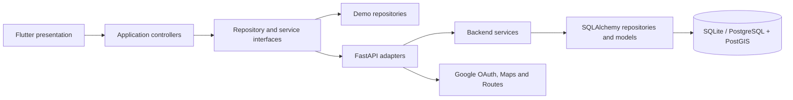
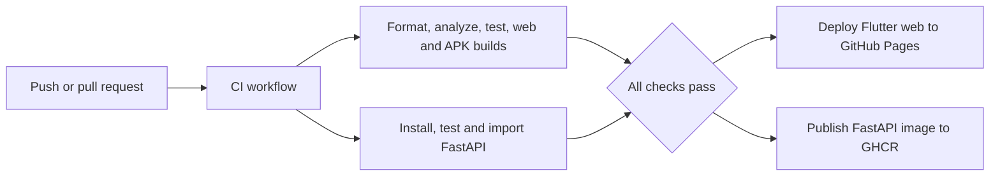

# Nyetam architecture

Nyetam uses layered architecture and dependency inversion so mobile screens, local demo data, device services, and remote APIs can evolve independently.

## Applied patterns

### Layered architecture

- `lib/domain` contains immutable entities and value objects.
- `lib/data` contains repository contracts and local implementations.
- `lib/services` contains device and HTTP adapters.
- `lib/presentation` contains controllers and widgets.
- `backend/app/routers` defines HTTP transport boundaries.
- `backend/app/services` owns backend use cases.
- `backend/app/database` owns persistence models and sessions.

### Repository pattern

Interfaces such as `PlaceRepository`, `EventRepository`, `ReviewRepository`, and `GuideRepository` hide the data source from controllers. Demo repositories can be replaced by FastAPI implementations without changing screens.

### Dependency injection

Repositories and services are provided through constructors in `main.dart`. Tests inject deterministic in-memory implementations instead of network or device dependencies.

### Observer pattern

Controllers extend `ChangeNotifier`. Widgets subscribe with `AnimatedBuilder`, keeping mutations in controllers and rendering in widgets.

### Strategy pattern

`DistanceCalculator` abstracts geographic distance calculation. `HaversineDistanceCalculator` is the current strategy and can be replaced without changing exploration behavior.

### Adapter pattern

`ApiAuthService`, `DeviceLocationService`, and `ApiRouteService` translate external APIs into domain-level results. Google identity tokens are exchanged for Nyetam JWTs instead of leaking provider-specific behavior through the app.

### Value objects and inheritance

`GeoPoint` represents coordinates without UI or persistence concerns. `Place`, `TripPlan`, `Review`, `TourGuide`, `TourismEvent`, and `CultureArticle` share the `TourismEntity` abstraction.

### Encapsulation

Controllers keep mutable sets and lists private and expose read-only views. Favorites, route stops, review reports, filters, and authenticated user state can only change through validated methods.

## Security boundaries

- Passwords are hashed with Argon2 and are never returned by the API.
- Google ID tokens are verified server-side before Nyetam JWT issuance.
- Access tokens use encrypted platform storage in Flutter.
- API keys and OAuth client IDs are supplied through environment configuration.
- Server-only Routes keys never enter Flutter or web artifacts.
- Administrative authorization should be enforced through `UserRole` dependencies as protected endpoints are added.

## CI/CD

CI executes for pushes and pull requests to `main`. Delivery runs only after successful CI on `main`, or through an explicit manual dispatch. GitHub Pages hosts the Flutter web build. GHCR stores immutable backend images tagged `latest` and by commit SHA. A production backend host can deploy that image without rebuilding source.